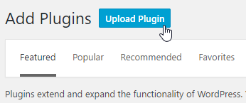
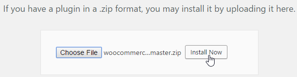
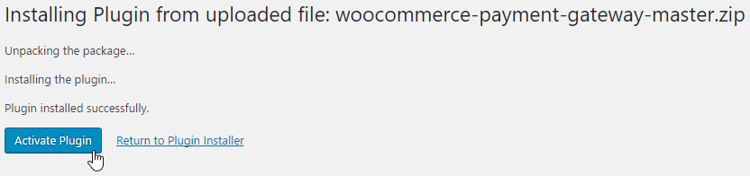
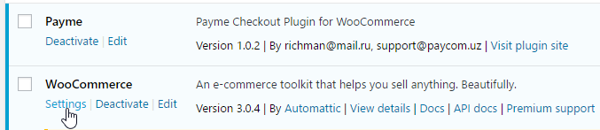
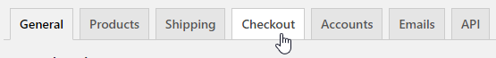
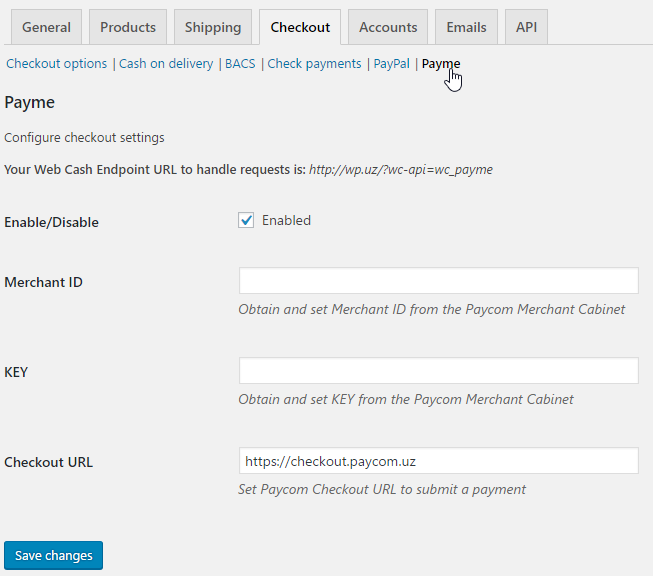
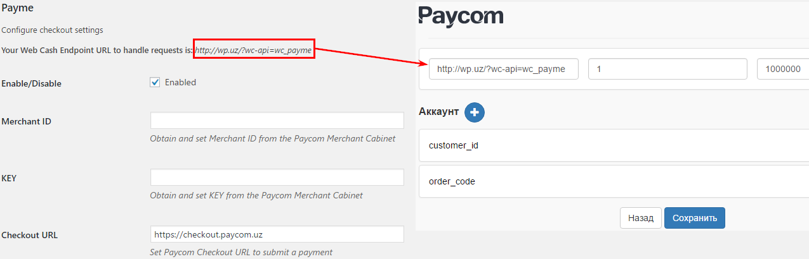

# WooCommerce plugin for Payme

## Установка

#### Требования

- PHP >= 7.4
- [WordPress 5.x](https://wordpress.org/) или новее
- [WooCommerce 4.x](https://woocommerce.com/) или новее (совместим с HPOS / Custom Order Tables)
- Регистрация в кабинете поставщика [Paycom](http://paycom.uz/)

#### GitHub

Скачайте плагин как ZIP архив.

Загрузите плагин в WordPress

...и установите его

Активируйте плагин после установки

Откройте страницу настроек WooCommerce

Откройте вкладку `Checkout`

Откройте вкладку `Payme` и внесите необходимые данные.

Скопируйте ваш `Endpoint URL` и внесите его в кабинете поставщика Paycom.

> **Nginx + PHP-FPM:** убедитесь, что заголовок `Authorization` доходит до PHP.
> Если callback-запросы Payme получают ошибку авторизации, добавьте в конфиг:
> `fastcgi_param HTTP_AUTHORIZATION $http_authorization;`

## Changelog

### 1.5.1

Повторный аудит выявил логическую ошибку в связке `CreateTransaction` →
`PerformTransaction`, оставшуюся из версии 1.4.8 и не замеченную в 1.5.0:

- **`payment_complete()` тихо не срабатывал.** `CreateTransaction` переводил
  заказ в статус `processing` ещё до подтверждения оплаты. Метод
  `WC_Order::payment_complete()` в ядре WooCommerce выполняет свою основную
  логику (проставляет `_date_paid`, ID транзакции, вызывает хук
  `woocommerce_payment_complete`) **только если заказ на момент вызова
  находится в `on-hold`, `pending`, `failed` или `cancelled`** — `processing`
  в этот список не входит. Поэтому дата оплаты не сохранялась, а сторонние
  плагины, завязанные на `woocommerce_payment_complete` (отчёты, партнёрки,
  уведомления), не срабатывали. Промежуточный статус «транзакция открыта,
  ждём оплату» заменён на `on-hold` (штатный статус WooCommerce «Ожидает
  оплаты», единственный из некомплитных статусов, который `payment_complete()`
  действительно обрабатывает).
- **`state` в ответах Payme теперь не зависит от статуса заказа.** Раньше
  `state` вычислялся из `$order->get_status()`, который могут поменять
  вручную (например, менеджер вернул заказ в `on-hold` по причине,
  не связанной с оплатой) — это исказило бы ответы `CheckTransaction`/
  `CancelTransaction`. Теперь состояние транзакции всегда выводится из
  собственных меток времени плагина (`_payme_create_time`/`_perform_time`/
  `_cancel_time`), а статус заказа используется только как побочный эффект
  для витрины/логистики.
- Повторный вызов `CreateTransaction` для уже созданной транзакции теперь
  возвращает её реальное текущее состояние (1/2/-1/-2), а не всегда «1»,
  как того требует протокол Payme.
- Страница возврата покупателя (`payme_success`) обновлена: статус ожидания
  теперь `on-hold`, а не `pending` — иначе покупатель мог увидеть
  «Спасибо за покупку» раньше, чем Payme реально подтвердил платёж.

### 1.5.0

Существенная переработка `payme.php` по итогам аудита кода. Основные изменения:

**Критические исправления**
- Совместимость с WooCommerce **HPOS** (Custom Order Tables): все обращения к
  заказу переведены на CRUD API (`wc_get_order()`, `$order->update_meta_data()`,
  `$order->get_meta()`, `wc_get_orders()`) вместо прямых запросов к
  `wp_postmeta` и `new WC_Order()`. Добавлено объявление совместимости через
  `FeaturesUtil::declare_compatibility('custom_order_tables', ...)`.
- Исправлен баг двойного экранирования в SQL-запросе `get_order_by_transaction()`
  (лишние кавычки вокруг `%s` в `$wpdb->prepare()`), из-за которого
  `PerformTransaction`/`CheckTransaction`/`CancelTransaction` могли не находить
  заказ по транзакции. Запрос заменён на `wc_get_orders()`.
- `wc_get_order()` вместо `new WC_Order()` + явная проверка результата — вместо
  надежды на исключение, которое WooCommerce не всегда бросает при неверном ID.
- Добавлена обязательная по протоколу Payme проверка **тайм-аута транзакции
  (12 часов / 43 200 000 мс)**: неоплаченная транзакция теперь автоматически
  отменяется с причиной «Отмена по таймауту» (4) и кодом ошибки `-31008`.
- `CheckPerformTransaction` теперь проверяет не только сумму, но и то, что
  заказ вообще находится в состоянии, допускающем оплату.
- Сравнение Basic Auth credentials переведено на `hash_equals()` (защита от
  timing-атаки).
- Добавлен `exit` после `wp_redirect()` на странице возврата с оплаты.

**Прочие улучшения**
- Единая функция конвертации суммы в тийины (`to_tiyin()`) — раньше форма
  оплаты и callback считали сумму двумя разными способами.
- Страница успешной оплаты (`payme_success`) переписана: больше не перехватывает
  глобальные хуки `the_title`/`the_content` (что раньше могло затирать
  заголовки/контент виджетов и меню на той же странице). Вместо этого
  используются штатные `wc_add_notice()` и редирект на стандартную страницу
  WooCommerce «Заказ получен». Добавлена проверка order key перед показом
  статуса оплаты.
- Логирование ключевых событий (`CreateTransaction`, `PerformTransaction`,
  `CancelTransaction`, отказы авторизации) через `wc_get_logger()` —
  Статус → Логи → источник `payme`.
- Более устойчивое чтение заголовка `Authorization` (fallback на
  `PHP_AUTH_USER`/`PHP_AUTH_PW` для серверов, где `getallheaders()` его не отдаёт).
- Экранирование вывода (`esc_attr`, `esc_url`, `esc_html`) в форме оплаты и
  в настройках администратора.
- Добавлены заголовки `Requires PHP`, `Requires at least`, `WC requires at least`,
  `WC tested up to` в шапке плагина.

### 1.4.8
Предыдущая версия (см. историю репозитория).
